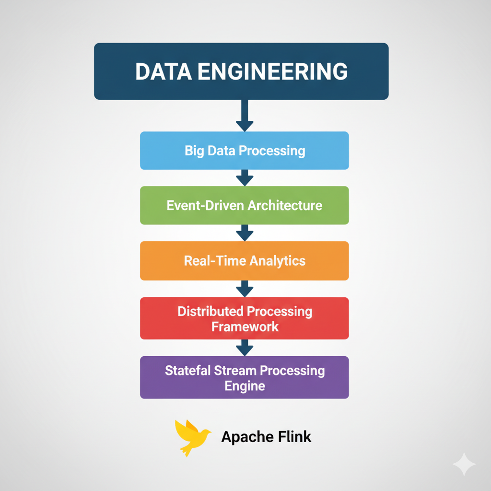

### What is Apache Flink?

At its core, **Apache Flink** is an open-source **framework** for processing data.

Its primary specialty is **stateful stream processing** over unbounded data (data that never ends, like sensor feeds or user activity logs). This means it can perform calculations (like counts, sums, or complex pattern detection) in real-time and *remember* the results of past events.

It is also a **unified** engine, meaning it can use the same technology to process bounded data (data with a clear end, like a daily report), which is traditionally known as **batch processing**. It is designed to be fast, reliable, and run at a massive scale across clusters of computers.

---

### Linear Hierarchy of Terms (Specific to Generic)

Here is the progression, starting with the specific tool and becoming more generic.

1.  **Apache Flink**
    * **What it is:** A specific, open-source software project. It is a tool you use to write data processing jobs.

2.  **Stateful Stream Processing Engine**
    * **What it is:** This is Flink's *classification*. It's an engine (it runs jobs) that processes streams of data (stream processing) while also remembering information from past data (stateful). This is its main purpose.

3.  **Distributed Processing Framework**
    * **What it is:** This describes *how* Flink works. It's a "framework" (it provides a structure for you to build on) that runs on many computers at once (distributed) to handle massive workloads. This category also includes tools like Apache Spark.

4.  **Real-Time Analytics**
    * **What it is:** This is the *business capability* that Flink enables. It's the practice of analyzing data *as it is created* to generate immediate insights (e.g., fraud detection, live dashboards, real-time recommendations).

5.  **Event-Driven Architecture**
    * **What it is:** This is the *architectural pattern* where Flink often lives. It's a system design where components react to "events" (like a click, a sale, or a reading) as they happen. Flink is often the component that processes, enriches, or analyzes these events in real-time.

6.  **Big Data Processing**
    * **What it is:** This is the *general problem* Flink is built to solve. It refers to any data processing that involves datasets so large (Volume), fast-moving (Velocity), or varied (Variety) that traditional software can't handle them.

7.  **Data Engineering**
    * **What it is:** This is the *professional discipline* or *field*. A Data Engineer is a person who builds the systems that collect, store, and transform data. Apache Flink is a one of the most powerful tools in a data engineer's toolkit.