# In-Page Navigation
{: .no_toc }

## Table of Contents
{: .no_toc .text-delta }

1. TOC
{:toc}

---

## **Part 1: The Terminologies (Glossary)**

* **Overflow Hole:** The round opening in the tub wall that prevents water from overflowing onto the bathroom floor
* **Cover Plate:** The visible chrome or plastic face plate that covers the overflow hole
* **Gasket/Seal:** The rubber ring that creates a watertight seal between the overflow pipe and the tub wall
* **Overflow Pipe:** The vertical pipe behind the tub wall that connects the overflow hole to the drain system
* **P-Trap:** The curved pipe section that prevents sewer gases from entering the bathroom
* **Main Drain:** The bottom drain in the tub that handles normal water drainage
* **Water Damage:** Ceiling stains, drywall damage, or mold indicating a failed seal

---

## **Part 2: Problem Identification & Assessment**

### **Signs of Gasket Failure**
1. **Visible water damage** on the ceiling below the bathroom
2. **Staining or discoloration** around the overflow cover plate
3. **Musty odors** indicating hidden moisture
4. **Loose or corroded** cover plate that won't stay tight
5. **Water pooling** behind the tub area

### **When to Replace vs. Repair**
- **Replace gasket only:** Visible deterioration but pipe is sound
- **Replace entire assembly:** Extensive water damage, pipe corrosion, or multiple leak points
- **Professional help needed:** Structural damage, mold presence, or access issues

---

## **Part 3: The Solution Process**

### **Assessment Phase**
1. **Safety First:** Turn off water supply if needed
2. **Document damage:** Take photos of current condition
3. **Test overflow function:** Fill tub past overflow level to identify leak location
4. **Check access:** Ensure you can reach the overflow area comfortably

### **Removal Process**
1. **Remove cover plate:** Unscrew center screw (usually Phillips head)
2. **Extract old gasket:** Carefully pull out deteriorated rubber seal
3. **Clean thoroughly:** Remove all old gasket material and buildup
4. **Inspect pipe condition:** Check for cracks or corrosion

### **Installation Steps**
1. **Position new gasket:** Ensure proper orientation and fit
2. **Align cover plate:** Center over gasket without pinching
3. **Tighten gradually:** Even pressure to avoid warping
4. **Test seal:** Fill past overflow level immediately

---

## **Part 4: System Architecture**

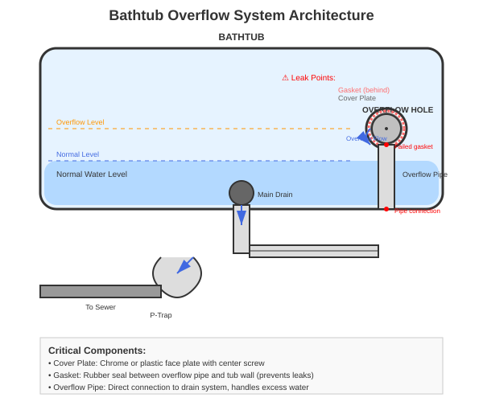
*Complete overflow system showing water flow, leak points, and component relationships*

---

## **Part 5: Replacement Process**

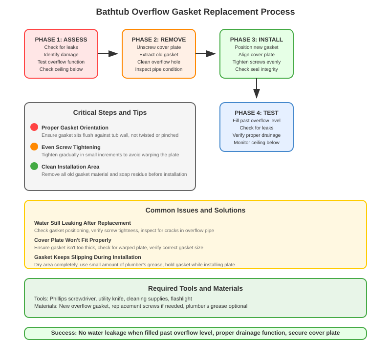
*Step-by-step process flow with critical success factors and troubleshooting guide*

---

## **Part 6: Photo Documentation**

### **Problem Assessment**
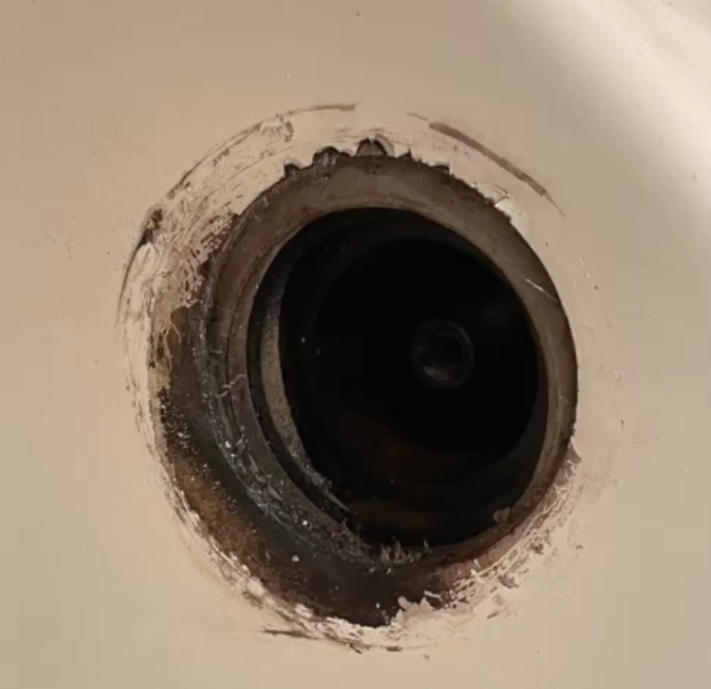
*Original overflow hole showing damaged gasket and deteriorated seal*

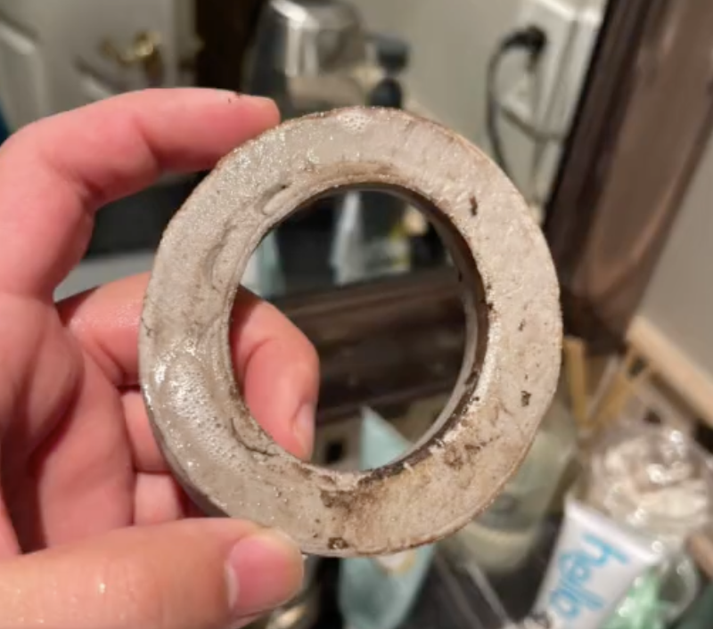
*Failed gasket removed from overflow pipe - front view showing wear patterns*

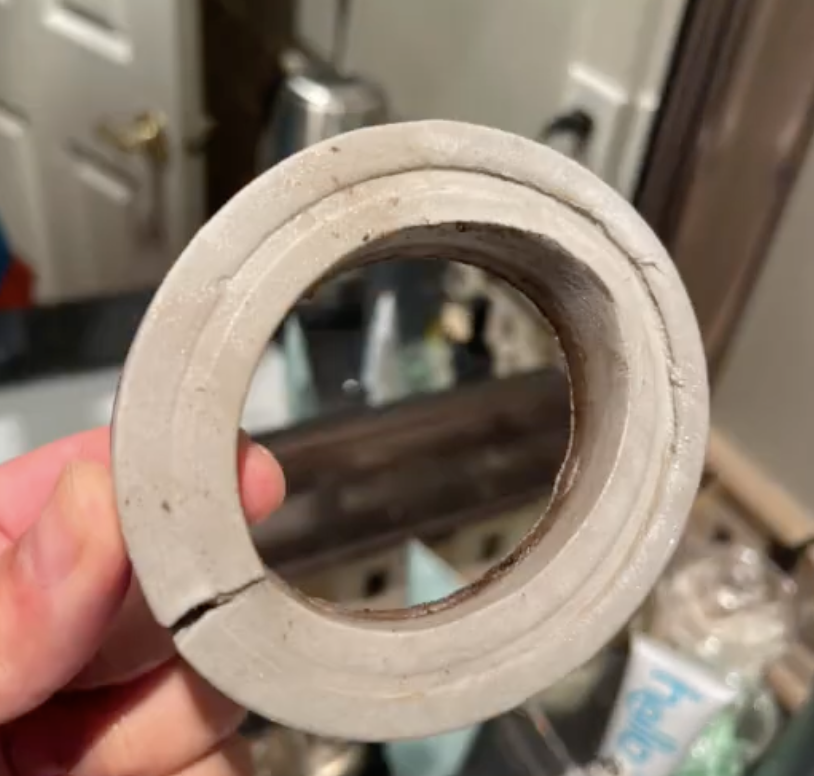
*Back view of removed gasket showing cracking and degradation*

### **Replacement Process**
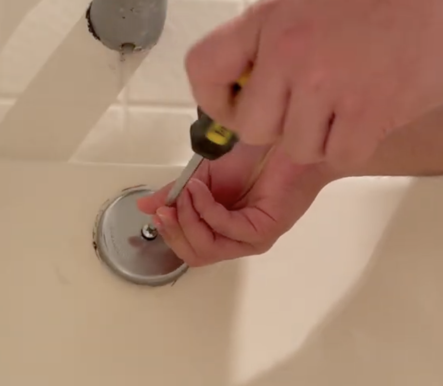
*Side-by-side comparison of old deteriorated gasket vs new replacement*

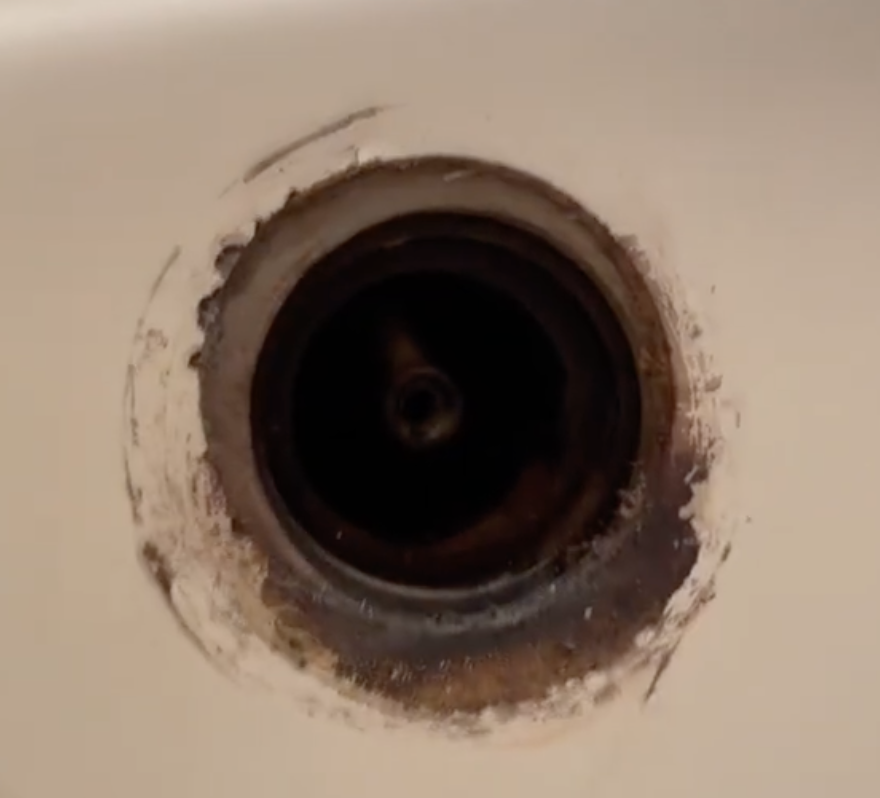
*New gasket prepared for installation with proper orientation*

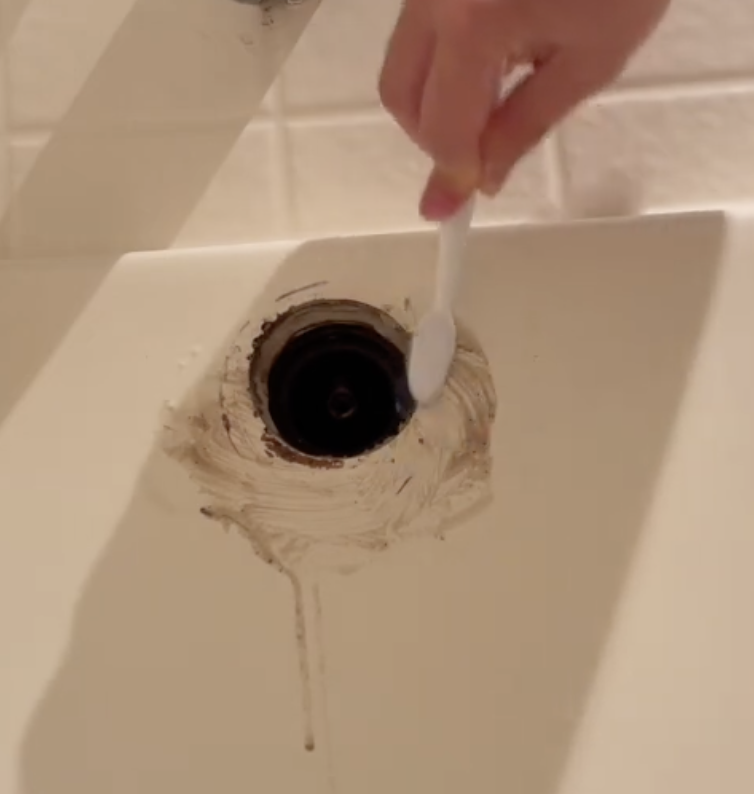
*Gasket being positioned in overflow pipe during installation*

### **Installation Completion**
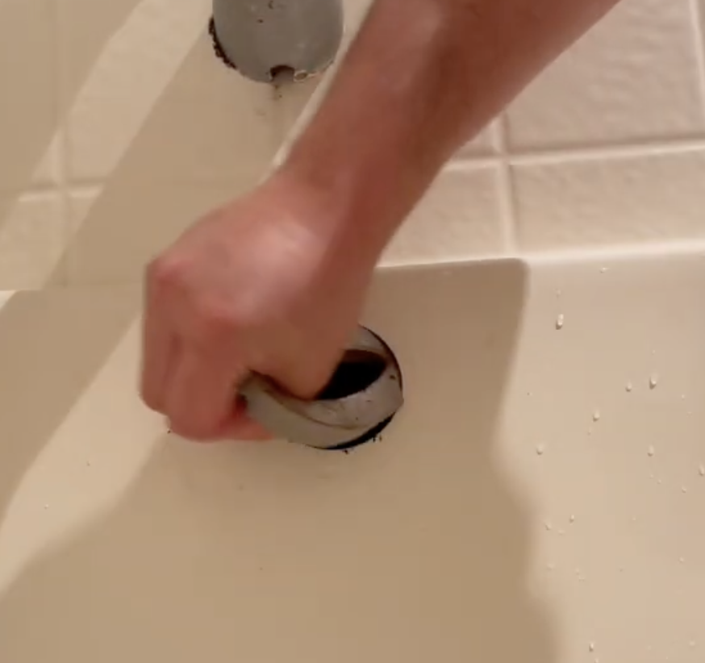
*New gasket properly seated against tub wall before cover plate installation*

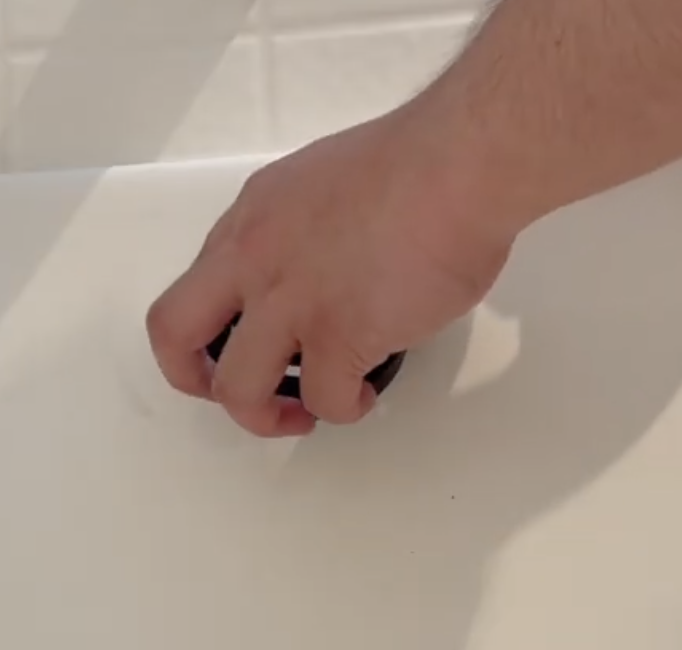
*Cover plate reinstalled with proper alignment and seal*

### **Tools & Final Result**
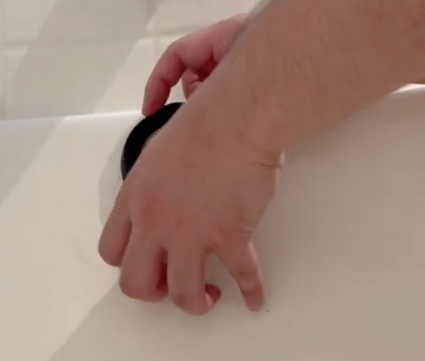
*Essential tools and materials required for the replacement project*

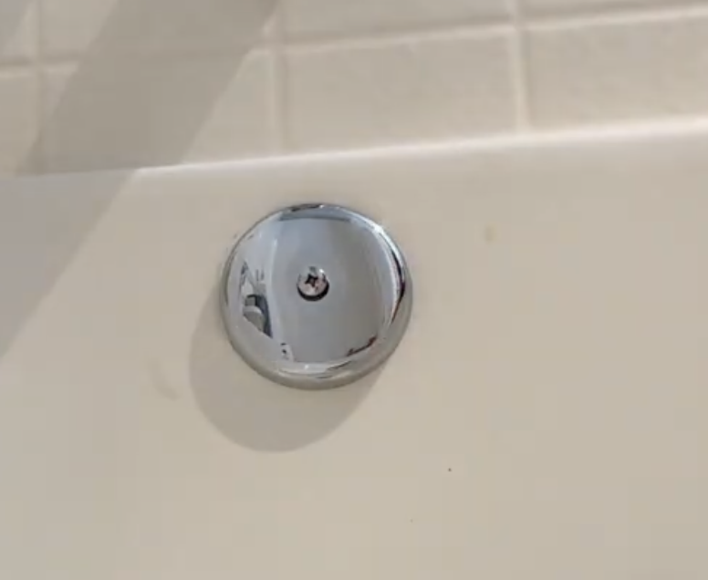
*Final completed installation showing professional finish and proper function*

---

## **Part 7: Material Specifications**

### **Gasket Types & Compatibility**

| Material | Durability | Cost | Best For |
|----------|------------|------|----------|
| Rubber | 5-7 years | Low | Standard applications |
| Neoprene | 10+ years | Medium | High-use tubs |
| Silicone | 15+ years | High | Premium installations |

### **Tools Required**
- Phillips head screwdriver
- Utility knife or razor blade
- Cleaning supplies (degreaser, rags)
- Flashlight or work light
- Plumber's grease (optional)

---

## **Part 8: Troubleshooting Guide**

### **Common Installation Issues**

#### **Problem: Gasket Won't Stay in Place**
- **Cause:** Area not clean or gasket wrong size
- **Solution:** Clean thoroughly, verify gasket diameter, use light coating of plumber's grease

#### **Problem: Cover Plate Won't Tighten**
- **Cause:** Gasket too thick or cross-threaded screw
- **Solution:** Check gasket compression, ensure screw threads properly

#### **Problem: Still Leaking After Replacement**
- **Cause:** Gasket not seated properly or pipe damage
- **Solution:** Reposition gasket, inspect overflow pipe for cracks

### **When to Call a Professional**
- Extensive water damage requiring drywall repair
- Corroded overflow pipe needs replacement
- Multiple leak points throughout drain system
- Lack of access to overflow area

---

## **Key Lessons Learned**

1. **Clean installation area thoroughly** - old gasket material prevents proper seal
2. **Test immediately after installation** - catch issues before they cause damage
3. **Choose quality gasket material** - invest in durability to avoid repeat repairs
4. **Tighten cover plate evenly** - prevents warping and ensures proper seal
5. **Address leaks promptly** - prevents extensive water damage and mold
6. **Document the process** - helps with future maintenance and warranty claims

This documentation provides a complete reference for bathtub overflow gasket replacement, from problem identification through successful completion and testing.