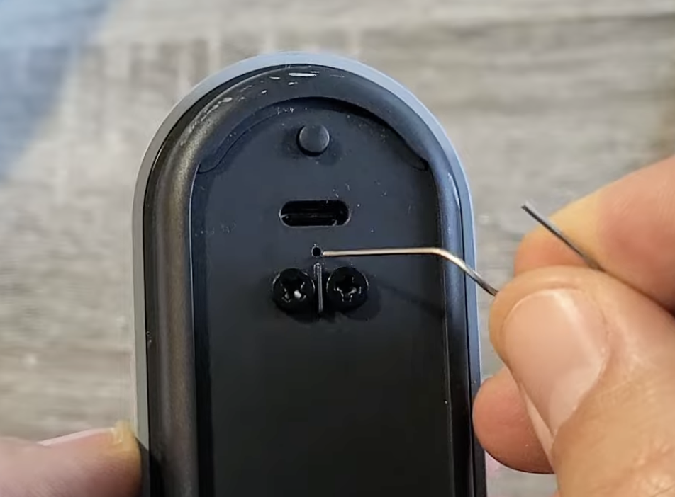

# In-Page Navigation
{: .no_toc }

## Table of Contents
{: .no_toc .text-delta }

1. TOC
{:toc}

---

## **Quick Context**

This guide is for the **Google Nest Doorbell (battery-powered model)**.

- Use **restart** first for minor issues.
- Use **factory reset** when reconnecting to Google Home.
- A factory reset erases local device settings and requires setup again in the Google Home app.

---

## **Part 1: Locate the Reset Pinhole**

On the back of the doorbell, find the small reset pinhole near the terminal area.

*Reset pinhole location on the back of the Google Nest Doorbell (battery model)*

---

## **Part 2: Restart (Keeps Settings)**

Use this when the doorbell is offline or acting glitchy, but you want to keep existing setup.

1. Insert a pin tool into the reset pinhole.
2. Press and hold for about **5 seconds**.
3. Release and wait for the doorbell to restart.

Your Google Home setup and device configuration stay intact.

---

## **Part 3: Factory Reset (Required for Reconnect)**

Use this when you need to reconnect or re-add the doorbell to Google Home.

1. Insert a pin tool into the reset pinhole.
2. Press and hold for about **10 seconds** until confirmation (tone/light pattern).
3. Release and let the device fully reset.
4. Open Google Home and add the doorbell as a new device.

> **Important:** For a Nest Doorbell reconnection scenario, do a **factory reset** first so Google Home can pair cleanly.

---

## **Part 4: QR Code Tip for Setup**

During setup, you may be asked to scan the QR code.

- The QR code is on the **back of the doorbell**.
- It is also available **inside the original packaging**.

If scanning fails, enter the setup key manually from the label.

---

## **Troubleshooting Notes**

- If the doorbell does not reset, ensure the pin is fully depressing the internal button.
- If setup fails after reset, remove any old instance in Google Home, then add again.
- Keep the doorbell close to your Wi-Fi access point during re-pairing.
