# In-Page Navigation
{: .no_toc }

## Table of Contents
{: .no_toc .text-delta }

1. TOC
{:toc}

---

## **Part 1: The Terminologies (Glossary)**

* **Line vs. Load:** * **Line:** The "always hot" wires coming from your breaker panel (The source).
* **Load:** The wires going directly to the heater (The destination).

* **Double-Pole (4-Wire) Thermostat:** A thermostat designed to cut power to both "hot" legs of a 240V circuit. It features a "True Off" mechanical click.
* **Single-Pole (2-Wire) Wall Box:** A setup where only one "leg" of the power is being switched at the wall. This is what you have.
* **Grounding (Chassis Ground):** The safety path. In this unit, it's the **Silver Metal Frame** (the chassis) that must be bonded to the house's **Bare Copper Ground Wire**.
* **Welding/Contact Pitting:** The failure mode of your old unit. When a thermostat is under-rated or poor quality, the internal metal plates spark and eventually melt together, staying "ON" forever.
* **Insulator:** A material (like the **Black Plastic Housing** or the **Clear Washer**) that blocks electricity.
* **Red Wing-Nuts:** High-capacity wire connectors. Specifically, we used the **Ideal 452** series, which is rated for the high amperage (current) that space heaters pull.

---

## **Part 2: The Streamlined Process (The "Perfect" Install)**

1. **Safety First:** Turn off the double-pole breaker and verify no heat is coming from the unit.
2. **Prep the Box:** Identify the **Line**, **Load**, and **Ground**. Strip exactly 1/2" of insulation.
3. **Prepare the Thermostat:** Remove all shipping materials, including the **plastic washers** hidden behind the mounting screws.
4. **Grounding:** Loop the bare copper ground wire around the top mounting screw and tighten it directly against the **silver metal frame**.
5. **Main Connections:** Use **Red Wing-Nuts** to connect the Black wall wire to the thermostat **LINE** and the Red wall wire to the thermostat **LOAD**.
6. **Capping:** Use individual **Red Wing-Nuts** to cap the unused **C1** and **C2** wires.
7. **Mounting:** Tuck wires carefully to avoid pinching. Screw the frame to the wall and snap on the aesthetic cover.
8. **Validation:** Turn on power and verify the mechanical "click" turns the heater on and off.

---

## **Part 3: The Reality (Troubleshooting & Pitfalls Avoided)**

This is the most important part of your documentation—the hurdles we actually jumped.

### **The "Metal Frame" Confusion**

* **Pitfall:** Thinking the outer gray part was plastic or that the black part was the frame.
* **Reality:** The gray plate is a metal chassis with a matte finish. Grounding to plastic does nothing; you successfully identified that the bare copper must touch the **silver plate** directly.

### **The "Hidden Insulator" (The Plastic Washer)**

* **Pitfall:** Leaving the clear plastic washer on the screw because it "came that way."
* **Reality:** We realized the washer was a shipping standoff. By removing it, you ensured **metal-to-metal** contact, which is the only way a ground is safe.

### **The 4-Wire to 2-Wire Logic**

* **Pitfall:** Confusion over why the thermostat had 4 wires but the wall only had 2.
* **Reality:** We followed the "Half-Usage" rule. You used the primary switch (Line/Load) and **individually capped** the second switch (C1/C2). Capping them separately prevents a short circuit.

### **Validation via Infrared**

* **Pitfall:** Blindly trusting the dial.
* **Reality:** You used an IR thermometer to see **117°F** (active heating) and **214°F** (internal element temp). This confirmed the heater was functionally working even if the dial's numbers were slightly off-calibration.

### **The "Welded Shut" Prevention**

* **Pitfall:** Replacing the old unit with a cheap, standard 15A thermostat.
* **Reality:** You installed a **28A-rated** industrial-grade thermostat. This "over-spec" approach ensures the internal contacts won't melt together again under the heavy load of your heater.

---

---

## **Part 4: System Architecture**

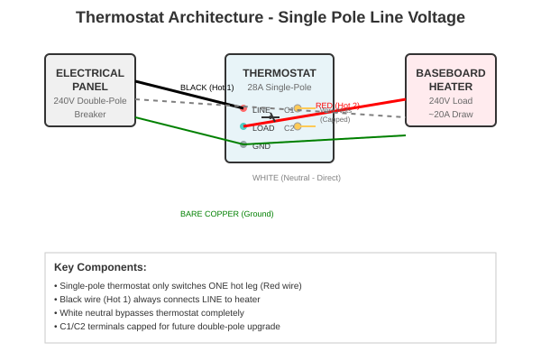
*Single-pole line voltage thermostat wiring architecture showing electrical connections, terminal usage, and component relationships*

---

## **Part 5: Installation Process**

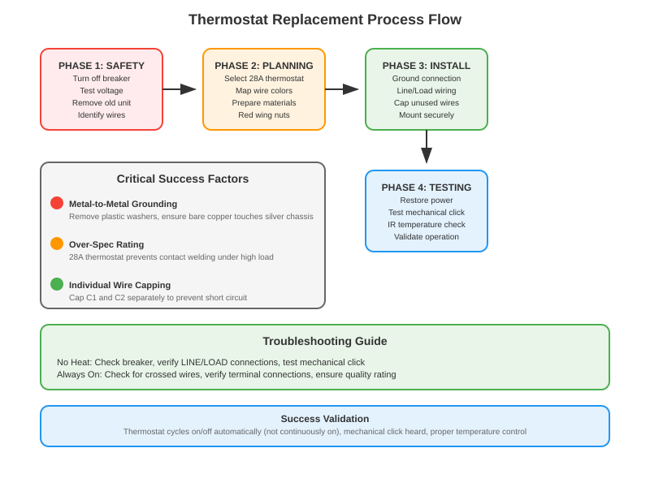
*Complete replacement process flow with critical success factors, common pitfalls, and validation criteria*

---

## **Part 6: Photo Documentation**

### **Problem Identification**
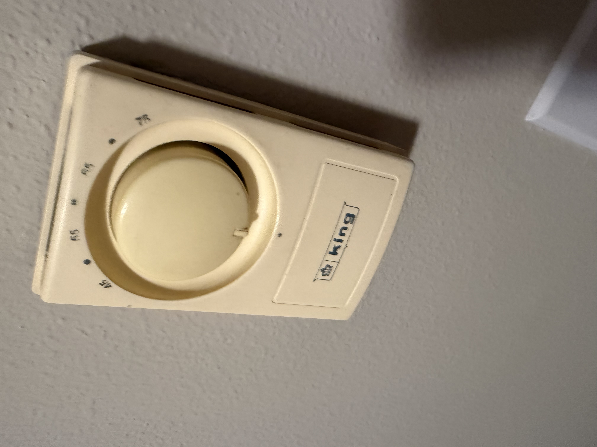
*The original King Electrical M801 thermostat that failed in the "always on" position*

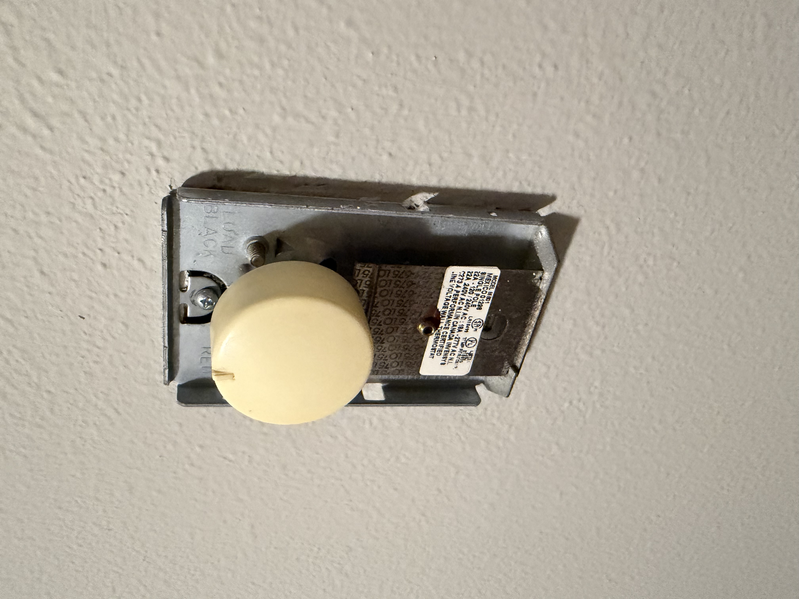
*Cover removed showing the single-pole line voltage configuration and internal components*

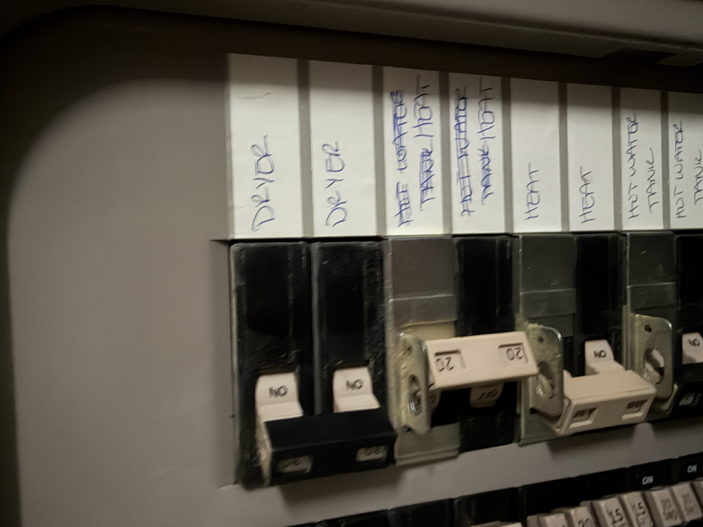
*Circuit breakers in electrical panel - safety first step is turning off power*

### **Replacement Selection**
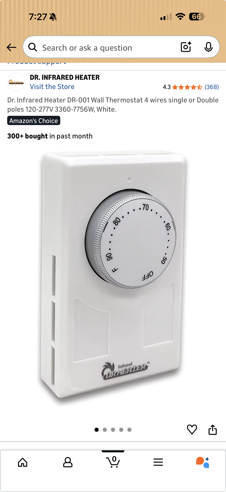
*Dr. Infrared Heater DR-001 Wall Thermostat - 28A rated replacement unit selected*

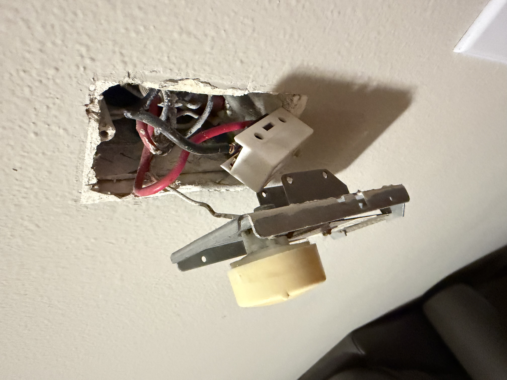
*Industrial-grade 28A thermostat with 4-wire capability for future upgrades*

### **Installation Process**
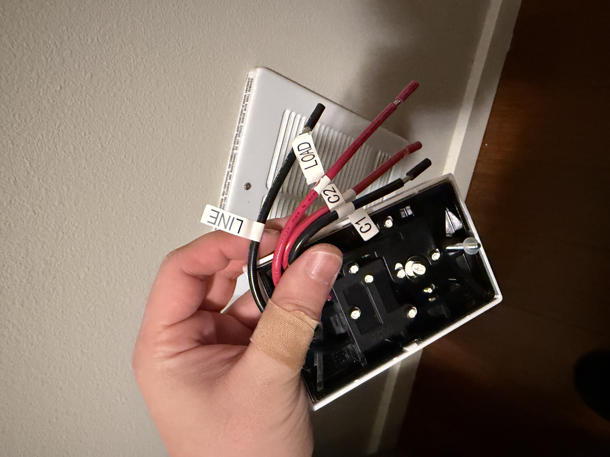
*Thermostat terminal identification: LINE, LOAD, C1, C2 with proper wire color coding*

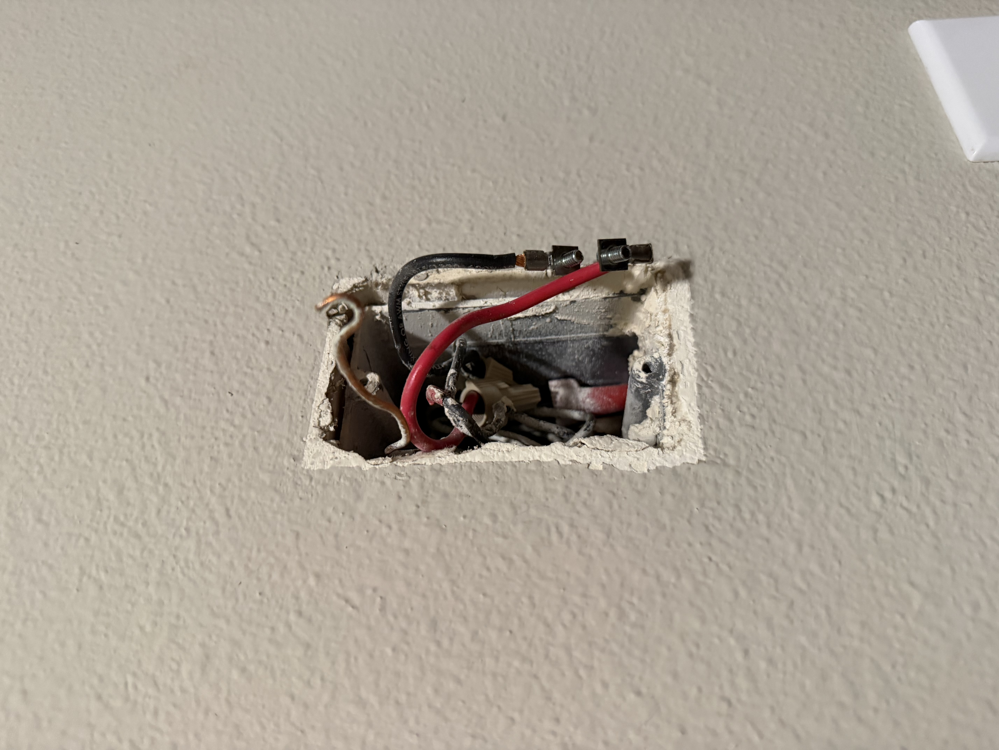
*Completed wall box installation showing proper wire management and connections*

### **System Documentation**
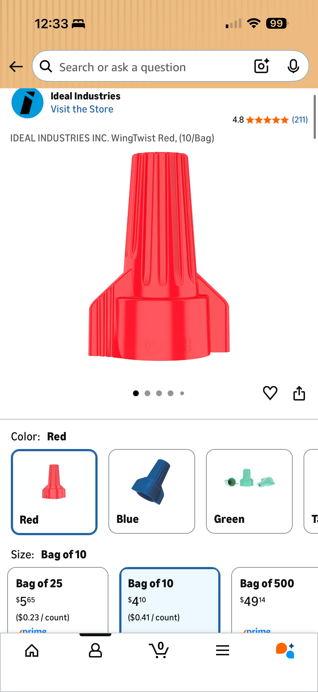
*Technical wiring diagram showing the single-pole configuration*

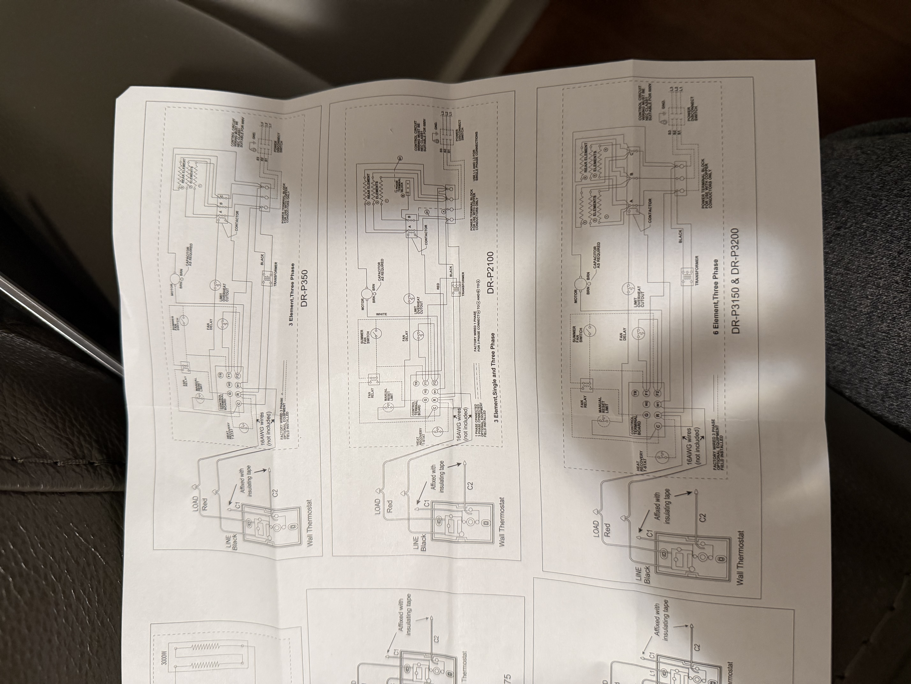
*Final installation with aesthetic cover - professional finish*

### **Validation & Testing**
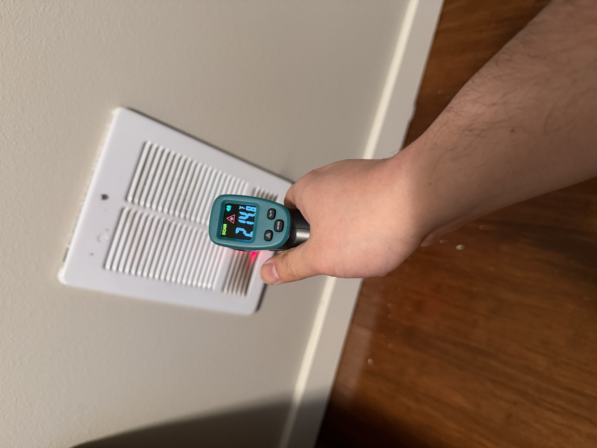
*Project completed successfully with full function validation and temperature control*

---

## **Part 7: Wire Color Reference Table**

| Wall Wire Color | Thermostat Terminal | Function |
|----------------|---------------------|----------|
| Black | LINE | Always hot from breaker panel |
| Red | LOAD | Power to heater |
| Bare Copper | Ground Screw | Safety ground to metal chassis |
| N/A | C1 | Capped (unused secondary switch) |
| N/A | C2 | Capped (unused secondary switch) |

---

## **Key Lessons Learned**

1. **Always remove plastic washers** from mounting screws for proper grounding
2. **Use red wing-nuts** (Ideal 452 series) for high-amperage connections
3. **Over-spec the thermostat rating** (28A vs 15A) to prevent contact welding
4. **Validate with IR thermometer** rather than trusting dial calibration
5. **Cap unused wires individually** to prevent short circuits
6. **Ensure metal-to-metal ground contact** for safety
7. **Success means proper cycling** - thermostat turns heater on and off automatically based on temperature, unlike the failed unit that stayed on continuously

## **Success Validation Criteria**

- ✅ **Mechanical click heard** when adjusting dial
- ✅ **Heater cycles on/off automatically** - does not stay on continuously
- ✅ **Temperature readings confirm function** - 117°F surface, 214°F element when active
- ✅ **Proper temperature control** - heater shuts off when set temperature reached
- ✅ **No continuous operation** - prevents overheating and energy waste

**Critical Difference:** The old thermostat failed with contacts welded shut, causing continuous operation. The new 28A-rated thermostat properly cycles based on temperature demand, ensuring safe and efficient heating operation.

This documentation serves as a complete reference for future thermostat replacements or troubleshooting of similar line-voltage heating systems.